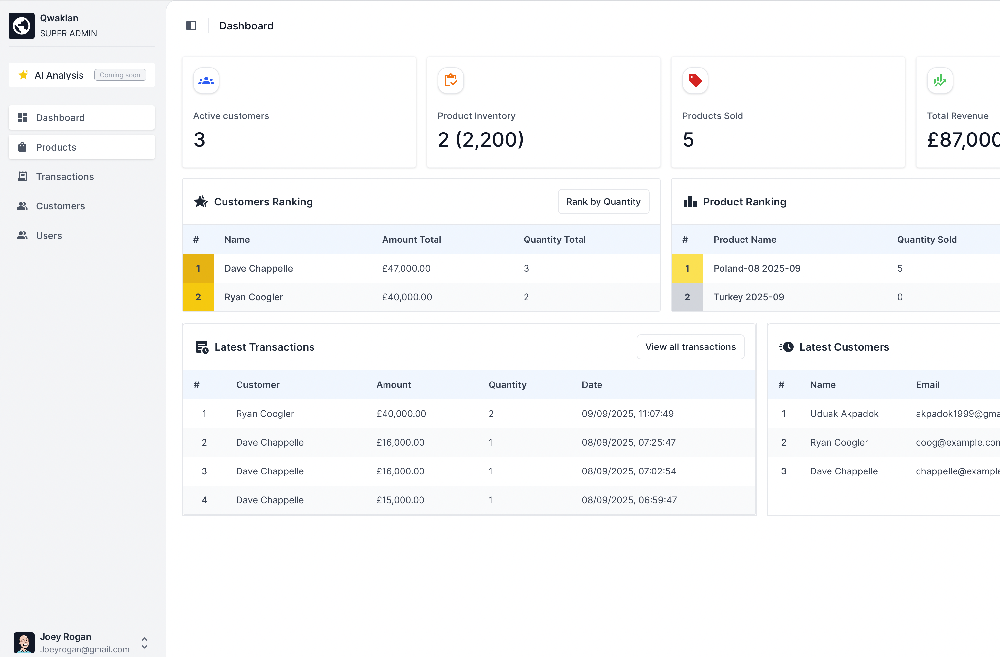
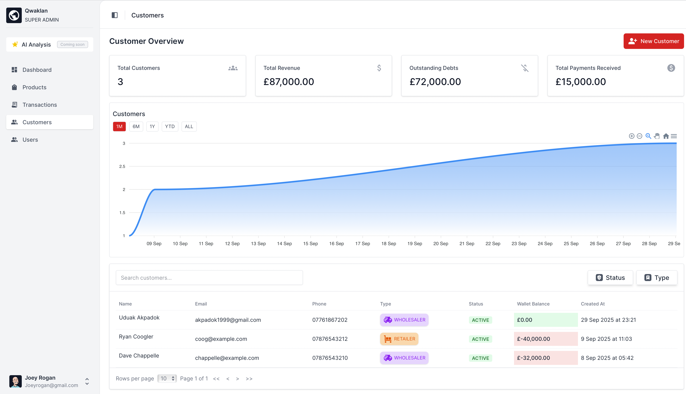
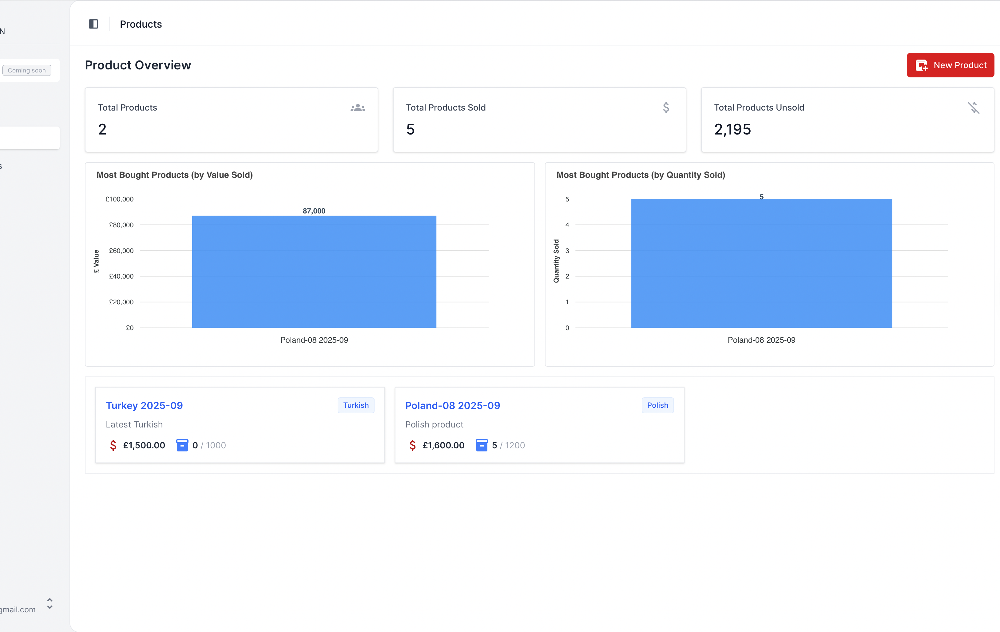

# Qwaklan

**Qwaklan** is a modern Customer-Product Management System designed to help businesses efficiently manage customers, products, and track sales growth. With built-in visualizations and analytics, Qwaklan provides a comprehensive overview of your business performance.

🔗 **Frontend Repository:** [Qwaklan Frontend](https://github.com/scientist-Momi/frontend-cpms)

---

##  Features

- **Customer Management**
    - Add, update, and track customers
    - Wallet management for tracking balances and transactions
- **Product Management**
    - Add, update, and manage product inventory
    - Track product sales and availability
- **Charts & Visualizations**
    - Customer growth trends
    - Sales growth over time
    - Product sales statistics and insights
- **Authentication & Security**
    - JWT-based authentication
    - Role-based access control (Admin/User)
- **Tech Stack**
    - Frontend: **Vue.js**
    - Backend: **Spring Boot**
    - Database: **MySQL**
    - Secure authentication with **JWT**

---

##  Screenshots / Visualizations

---

##  Usage

- Log in with admin credentials to access full functionality
- Add or update customers and manage wallets
- Manage products and track sales
- Create and manage transactions
- Explore charts for customer growth, sales trends, and product insights

##  Try App

[Qwaklan App](https://qwaklan.oolumomi.dev)